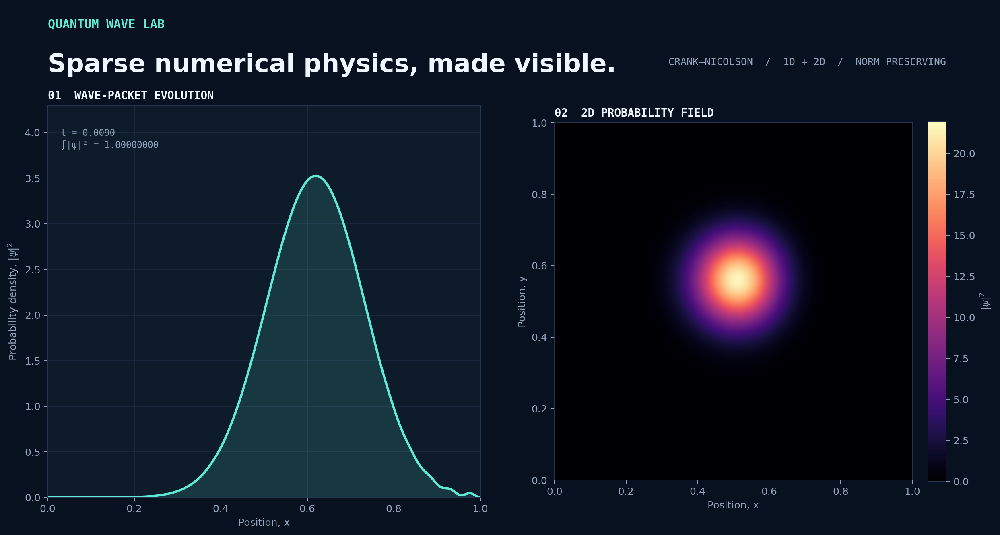

<div align="center">

# Quantum Wave Lab

**An interactive, sparse numerical simulator for the time-dependent Schrödinger equation.**

[](https://github.com/gragi-1/Wave-equation-numerical-simulation/actions/workflows/ci.yml)
[](https://www.python.org/)
[](https://docs.astral.sh/ruff/)
[](LICENSE)



</div>

Quantum Wave Lab evolves Gaussian wave packets inside 1D and 2D infinite potential wells.
It combines a norm-preserving Crank–Nicolson integrator, sparse finite-difference operators,
and responsive Matplotlib views in a small, testable Python package.

## Highlights

- **Numerically robust:** exact Dirichlet boundaries and a second-order Crank–Nicolson update.
- **Sparse by design:** SciPy sparse matrices replace the original dense 2D operators.
- **Interactive:** pause, resume, reset, inspect the conserved norm, and rotate the 3D view.
- **Reusable:** the solver, state builders, operators, and UI live in separate modules.
- **Quality checked:** tests cover normalization, boundary conditions, matrix structure, reset
  behavior, and probability conservation; CI runs on Python 3.10 and 3.13.

## Quick start

```bash
git clone https://github.com/gragi-1/Wave-equation-numerical-simulation.git
cd Wave-equation-numerical-simulation

python -m venv .venv
```

Activate the environment with `.venv\Scripts\activate` on Windows or
`source .venv/bin/activate` on macOS and Linux, then install the package and choose a view:

```bash
python -m pip install -e .

quantum-wave 1d
quantum-wave 2d --view heatmap
quantum-wave 2d --view surface
```

The same interface is available without the installed console script:

```bash
python -m quantum_wave 1d
```

## Customize a simulation

Every important initial-condition and rendering parameter is available from the CLI:

```bash
quantum-wave 1d \
  --points 320 \
  --time-step 0.00004 \
  --center 0.28 \
  --width 0.055 \
  --wave-number 36

quantum-wave 2d \
  --view surface \
  --points 72 \
  --center-x 0.30 \
  --center-y 0.55 \
  --wave-number-x 24 \
  --wave-number-y 6
```

Run `quantum-wave 1d --help` or `quantum-wave 2d --help` for the complete option list.
The default configuration uses dimensionless units with $\hbar = m = L = 1$.

## Python API

The numerical core can be used independently of the visual interface:

```python
from quantum_wave import create_2d_simulation

simulation = create_2d_simulation()
density = simulation.step(100)

print(density.shape)  # (64, 64)
print(simulation.solver.time)  # 0.01
print(simulation.solver.total_probability)  # approximately 1.0
```

Custom static potentials can be passed as NumPy arrays to `create_1d_simulation` or
`create_2d_simulation`. Arrays may include the boundary nodes or contain only interior
values.

## How it works

The time-dependent Schrödinger equation is

$$
i\hbar\frac{\partial\psi}{\partial t} = \hat{H}\psi,
\qquad
\hat{H} = -\frac{\hbar^2}{2m}\nabla^2 + V.
$$

Space is discretized with centered finite differences. Time evolution uses the
Crank–Nicolson system
$$
$$
$$
\left(I + \frac{i\Delta t}{2\hbar}H\right)\psi^{n+1}
=
\left(I - \frac{i\Delta t}{2\hbar}H\right)\psi^n.
$$

For a Hermitian, time-independent Hamiltonian, this update is unitary up to floating-point
roundoff. The implementation factorizes the sparse left-hand matrix once and reuses it at
every step. Read the [numerical method](docs/numerical-method.md) for the derivation,
boundary treatment, accuracy guidance, and complexity notes.

## Project structure

```text
.
├── src/quantum_wave/
│   ├── cli.py             # Command-line interface
│   ├── config.py          # Validated simulation parameters
│   ├── operators.py       # Sparse Laplacian and Hamiltonian
│   ├── simulation.py      # High-level simulation factories
│   ├── solver.py          # Crank–Nicolson integrator
│   ├── states.py          # Wave-packet construction
│   └── visualization.py  # Interactive 1D, heatmap, and surface views
├── tests/                 # Numerical and behavioral regression tests
├── docs/                  # Method notes and generated artwork
└── scripts/               # Reproducible project-asset generation
```

## Development

```bash
python -m pip install -e ".[dev]"
ruff format --check .
ruff check .
pytest --cov=quantum_wave --cov-report=term-missing
```

See [CONTRIBUTING.md](CONTRIBUTING.md) for the project conventions. The README artwork is
generated from real simulation data and can be reproduced with:

```bash
python scripts/generate_showcase.py
```

## Scope

This is an educational numerical-physics project, not a general-purpose quantum dynamics
framework. It currently assumes a uniform Cartesian grid, a time-independent potential,
and zero Dirichlet boundaries. Natural extensions include absorbing boundaries, additional
initial states, expectation-value diagnostics, and convergence benchmarks.

## License

Distributed under the [MIT License](LICENSE).
